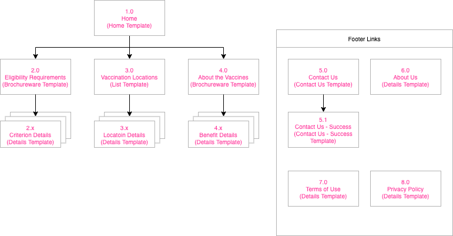
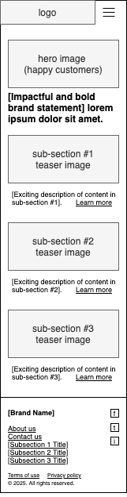
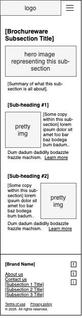
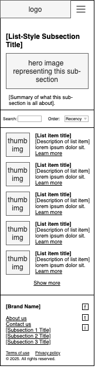
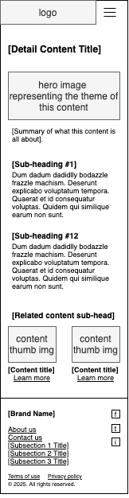
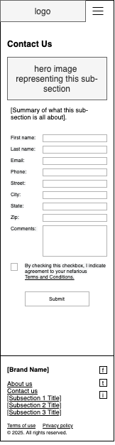

# Wireframes

The wireframes in this folder show an extremely generic web site or app, to keep things simple.

The imaginary project we are working on is a site where visitors can determine whether they are eligible for a COVID-19 vaccine, and see a list of vaccination locations.

There are 6 templates from which all screens of the web site or app would be created:

- [home screen](#home-template) template
- a template for a sub-section that contains [brochureware](#brochureware-template)
- a template for a sub-section that contains a searchable [list of items](#list-style-template)
- a template for a [details screen](#details-template) on a topic
- a template for a [contact us-style screen](#contact-us-template)
- a template for a [a confirmation message when the user submits the contact us form](#contact-us-success-template)

## Site map

The site map shows how we intend to use the various wireframe templates to produce actual pages.

## Home Template

For a home screen. It is presumed that the main content links on this screen would link to screens that follow either the brochureware template or the list-style template.

## Brochureware Template

For a sub-section that contains brochure-ware for passive consumption. Each section would have a link to a screen that follows the Details Template below.

## List-Style Template

For a sub-section that contains list-style content that is searchable. Each list item would link to a screen that follows the Details Template below.

## Details Template

For a screen that shows the full details of a certain theme or topic.

## Contact Us Template

For a screen that contains a form users can fill out and submit to get in touch with the web site or app managers. Submitting the form would result in the display of a screen following the Contact Us - Success template.

## Contact Us - Success Template

A template that shows how the Contact Us template would change once the user submitted the form.

