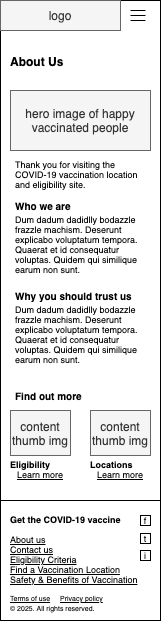

# Mockups

In order to be placed into a [clickable prototype](../3.prototype), the original [wireframe diagrams](../1.wireframes) must be made to look a bit more "real".

Whereas the wireframes were intentionally abstract, lacking any real-looking copy or imagery, we try to make these mockups a bit more concrete to help communicate the vision of each screen to stakeholders and developers.

Let's imagin we were planning a web site where visitors could find out information about

## Site map

The site map shows how we intend to use the various wireframe templates to produce actual pages.

## 1.0 Home Screen

The home screen that visitors see when they first arrive through the "front door".

## 1.0 Hamburger menu

When a user clicks the hamburger icon in the top-right, this menu appears, with links to all the main screens.

## 2.0 Eligibility

## 2.x Eligibility Criterion Details

There would be multiple screens made for each eligibility category. This mockup shows just one example of details of an eligibility category.

## 3.0 Vaccination Locations

A list of vaccination locations, with ability to search by zip code.

## 3.x Location Details

There would be multiple screens made for each vaccination location. This mockup shows just one example of details of a location.

## 4.0 About the Vaccine

Brochureware about the vaccine, i.e. it's benefits and safety.

## 4.x Vaccine Benefit Details

There would be multiple screens made for each benefit of the vaccine. This mockup shows just one example of details of a benefit.

## 5.0 Contact Us

A simple form for a user to fill out in order to be contacted when the vaccine is available for them.

## 5.1 Contact Us - Success

A confirmation message that the contact us form has been successfully submitted.

## 6.0 About Us

A bit of information about our imaginary organization and the good it does for society.

## 7.0 Terms of Use

Some legalese describing the user agreement.

## 6.0 About Us

A bit of information about our imaginary organization and the good it does for society.

